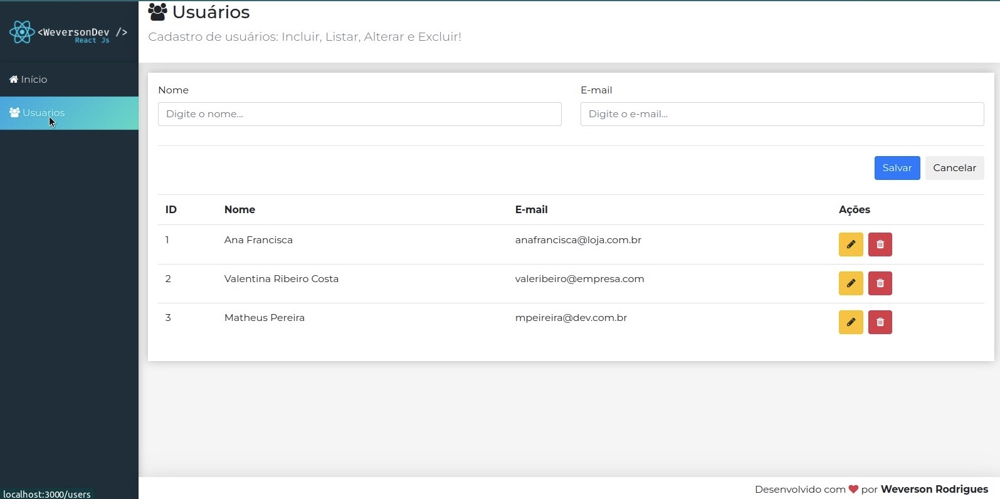

<h1 align="center"> CRUD </h1>

Promovido pela Cod3r Cursos Online de Tecnologia.

  <a href="#-tecnologias">Tecnologias</a>&nbsp;&nbsp;&nbsp;|&nbsp;&nbsp;&nbsp;
  <a href="#-projeto">Projeto</a>&nbsp;&nbsp;&nbsp;|&nbsp;&nbsp;&nbsp;
  <a href="#-layout">Layout</a>&nbsp;&nbsp;&nbsp;|&nbsp;&nbsp;&nbsp;
  <a href="#memo-licença">Licença</a>

  

 

  

## 🚀 Tecnologias

Esse projeto foi desenvolvido com as seguintes tecnologias:

- JavaScript
- React js e Jsx
- HTML e CSS
- Bootstrap
- Font-awesome
- Axios
- Json-server
- Node e NPM
- Git e Github

## 💻 Projeto

Sistema para exemplificar a construção de um cadastro CRUD desenvolvido em React!

## 🔖 Layout

Você pode visualizar o layout do projeto através [DESSE LINK]().

## :memo: Licença

Esse projeto está sob a licença MIT.

---

Feito com ♥ by Weverson Rodrigues
